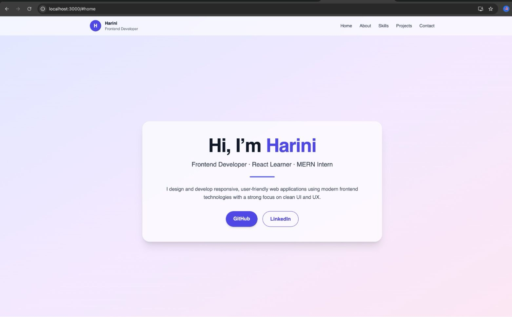
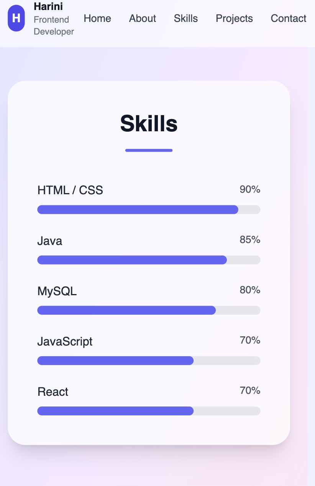

# Personal Portfolio Website – React

A responsive and animated personal portfolio website built using **React.js**, **Tailwind CSS**, and **Framer Motion** as part of my MERN Stack Internship Task.

## 🚀 Features
- Single-page React application
- Component-based architecture
- Fully responsive (Mobile / Tablet / Desktop)
- Smooth animations using Framer Motion
- Modern UI with Tailwind CSS
- Sticky navigation bar
- Social media links

## 🛠 Technologies Used
- React.js
- JavaScript (ES6)
- Tailwind CSS
- Framer Motion
- HTML & CSS
- Git & GitHub

## 📂 Sections
- Home
- About Me
- Skills
- Projects
- Contact

## 📸 Screenshots

### Desktop View

### Mobile View

### Animations

## 🔗 Live Demo
(Optional) Add Netlify/Vercel link here

## 📁 GitHub Repository
https://github.com/Harini1507/react-portfolio

## 👩‍💻 Author
**Harini Senthil**
